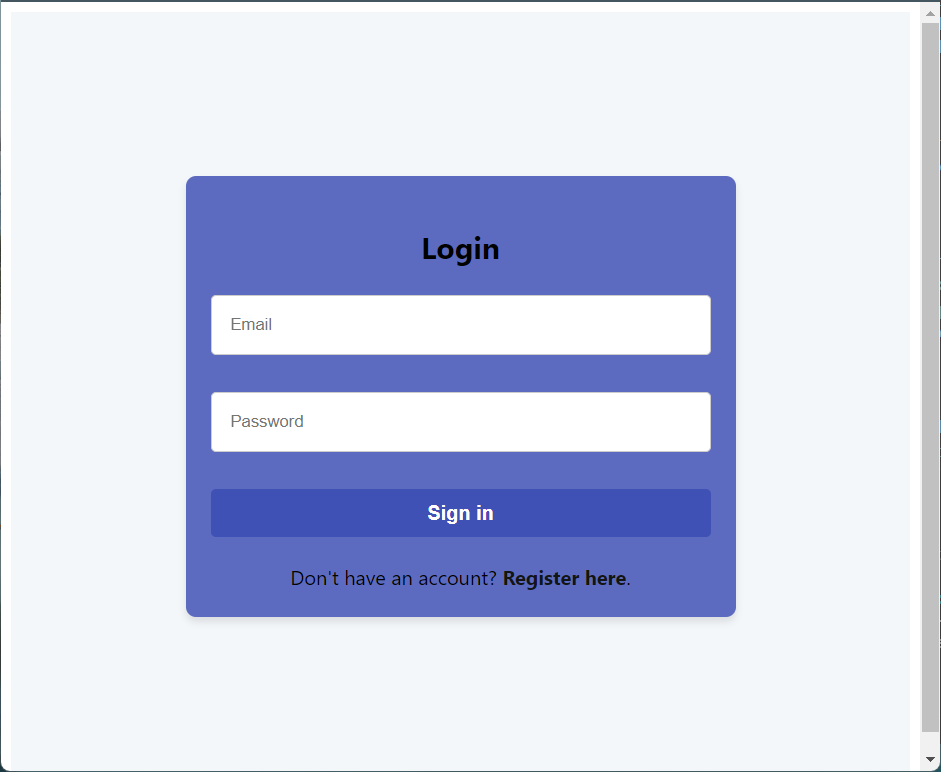
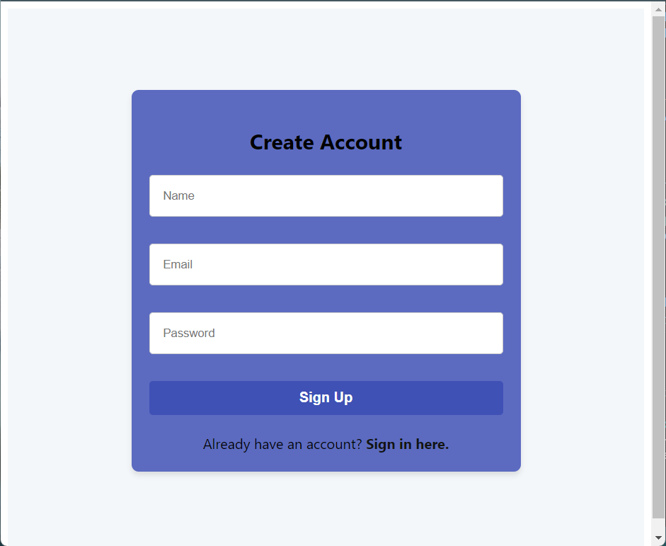
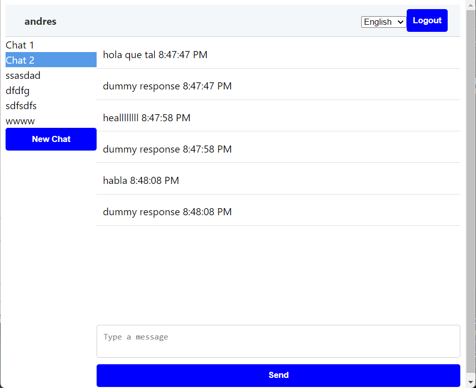

# Chat app

## Description

Chat app is a simple chat application that allows users to create chat rooms and send messages to each other.

## Technologies

- Frontend: Svelte
- Backend: Node.js, Prisma ORM, PostgreSQL

## App Images

### Login



### Register



### Chat rooms



## Installation and usage

### Backend

```
cd chat_backend
bun install
bun run dev
```

```
open http://localhost:3000
```

Clear cache

```
bun pm cache rm
```

Clear data of database

```
rm -r data/postgres
```

Connect to database in docker container

```
docker exec -it $DOCKER_PG_CONTAINER_ID psql -U user db
```

Run DB development

```
docker-compose -f docker_compose.yml up -d
```

Run DB testing

```
docker-compose -f docker_compose_test.yml up -d
```

Run Prisma migration on dev enviroment

```
bun --env-file=.env.dev run prisma migrate deploy
```

Run tests on dev enviroment with dotenv and Prisma ORM

```
bunx dotenv -e .env -e .env.test -- bun test
```

### Frontend

```
cd chat_frontend
npm install
npx vite --port=4000
```

### Run backend with env variables and frontend, ready to use

```
Backend folder --> bun --env-file .env.dev dev
Frontend folder -->npm run dev
```
